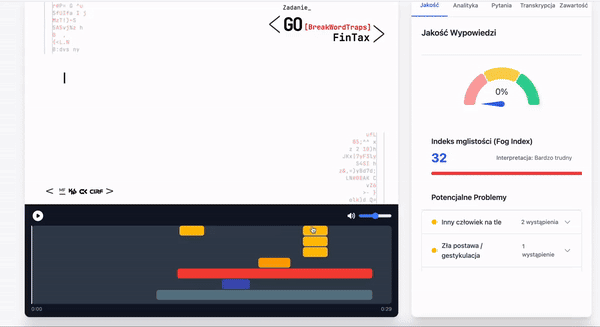
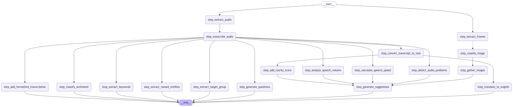

# SłowoMistrz v1.0



## Wprowadzenie

SłowoMistrz to zaawansowane narzędzie do analizy i poprawy jakości wypowiedzi, stworzone z myślą o profesjonalistach, mówcach i wszystkich, którzy chcą udoskonalić swoje umiejętności komunikacyjne. Projekt łączy w sobie najnowocześniejsze technologie przetwarzania języka naturalnego i uczenia maszynowego, aby dostarczyć kompleksową analizę mowy zarówno pod względem treści, jak i formy.

## Funkcjonalności
- Transkrypcja audio do tekstu z wysoką dokładnością
- Analiza tempa mowy (WPM - Words Per Minute)
- Wykrywanie problemów w wypowiedzi (np. słowa wypełniające, powtórzenia)
- Ocena klarowności wypowiedzi (indeks mglistości Gunninga)
- Ekstrakcja słów kluczowych i analiza sentymentu
- Identyfikacja grupy docelowej
- Generowanie sugestii poprawy
- Wizualizacja danych w postaci wykresów i diagramów
- Interfejs użytkownika umożliwiający łatwe przeglądanie i analizę wyników


## Struktura projektu



Projekt SłowoMistrz składa się z dwóch głównych komponentów:
1. Backend (Python):
- Znajduje się w katalogu speech_grade/
- Zawiera logikę przetwarzania audio, analizy tekstu i generowania wyników
2. Frontend (React):
- Znajduje się w katalogu speech_grade_frontend/frontend/
- Zapewnia interfejs użytkownika do interakcji z systemem

### Kluczowe komponenty backendu:
`speech_grade/src/speech_grade/pipeline/`: Zawiera główną logikę przetwarzania i analizy
`speech_grade/src/speech_grade/pipeline/prompts/`: Definicje promptów dla modeli językowych
`speech_grade/src/speech_grade/pipeline/tools/`: Narzędzia pomocnicze do analizy audio i tekstu

### Kluczowe komponenty frontendu:
`speech_grade_frontend/frontend/src/components/`: Reużywalne komponenty React
`speech_grade_frontend/frontend/src/App.js`: Główny komponent aplikacji
`speech_grade_frontend/frontend/src/VideoList.js`: Komponent do wyświetlania listy analizowanych wideo

## Technologie
Backend:
- Python 3.8+
- FastAPI
- OpenAI API (GPT-4)
- Google Cloud AI (Vertex AI)
- Langchain
- Pydub
- OpenCV
Frontend:
- React
- Tailwind CSS
- Chart.js
- Axios

## Instalacja


1. Sklonuj repozytorium:
   ```
   git clone https://github.com/mipo57/hackyeah-2024.git    
   cd hackyeah-2024
   ```
2. Zainstaluj zależności backendu:
   ```
   cd speech_grade
   rye sync
   ```
3. Zainstaluj zależności frontendu:
   ```
   cd speech_grade_frontend
   npm install
   ```

4. Skonfiguruj zmienne środowiskowe:
    Utwórz plik .env w katalogu speech_grade/ i dodaj niezbędne klucze API:
    ```
    OPENAI_API_KEY=<twój_klucz_API>
    ```

## Uruchomienie

1. Uruchom backend:
   ```
   cd speech_grade/src/speech_grade
   python app.py
   ```
2. Otwórz nowy terminal i uruchom serwer frontendu:
   ```
   cd speech_grade_frontend/frontend
   npm start
   ```
3. Otwórz przeglądarkę i przejdź pod adres http://localhost:3000


## Licencja

Ten projekt jest dostępny na licencji zgodnej z regulaminem HackYeah 2024.

## Kontakt
Michał Pogoda-Rosikoń - michal.pogoda@bards.ai